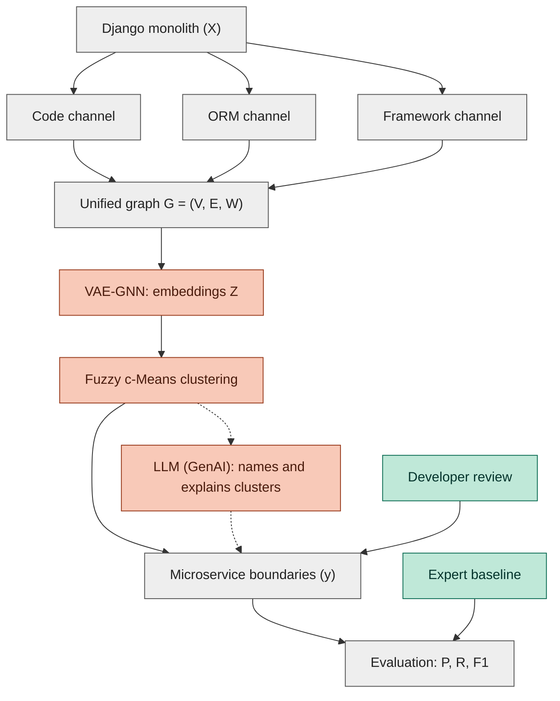

# Preliminary process model: AI in the thesis

```mermaid
flowchart TD
    X["Django monolith (X)"]

    X --> C1["Code channel"]
    X --> C2["ORM channel"]
    X --> C3["Framework channel"]

    C1 --> G["Unified graph G = (V, E, W)"]
    C2 --> G
    C3 --> G

    G --> V["VAE-GNN: embeddings Z"]
    V --> F["Fuzzy c-Means clustering"]
    F --> Y["Microservice boundaries (y)"]
    Y --> E["Evaluation: P, R, F1"]

    F -.-> L["LLM (GenAI): names and explains clusters"]
    L -.-> Y
    D["Developer review"] --> Y
    EX["Expert baseline"] --> E

    classDef ai fill:#f8c9b8,stroke:#993c1d,color:#4a1b0c
    classDef human fill:#bfe8d8,stroke:#0f6e56,color:#04342c
    classDef data fill:#eeeeee,stroke:#555,color:#222

    class V,F,L ai
    class D,EX human
    class X,C1,C2,C3,G,Y,E data
```
